# Do LMMs’ language obey the Zipf's law? An exploratory analysis. 

## Philosophy
***
### Introduction
According to Zipf's law, _if a set of measured values is sorted in decreasing order, the value of the n-th entry is often approximately inversely proportional to n_. Since Zipf’s law holds for human-generated text and speech, one can ask whether the law is encoded in a way in which we use the language to refer to external entities or it emerges from the intrinsic properties of language such as syntactic relations between signs. One of the ways of examining this question is measuring Zipf's law  properties in purely relational usage of language employed by LLMs. To be precise: we assume that LLMs’s  semantics can be described as nonextensional, usage-based characterization of meaning as the relations between particular words. Thus, it is an interesting question to examine whether Zipf’s law describes the way in which LLMs use language properly. 

In conducting an analysis of the entropy present in prompts and responses, we will essentially be reconstructing the experiments run by Shannon (1951) and Moradi, Grzymala-Busse, and Roberts (1998), albeit with a more advanced AI model for text prediction. This analysis will give us insight into the entropy of the English language, the entropy-reducing power of the LMM model, and at least a qualitative examination of the correlation between entropy and semantic content. We would like to strongly emphasise, that the project is conducted as an exploratory analysis.

 The purpose of the project is threefold:
- Provide an exploratory analysis of the word-occurrences in LLM’s language 
- Measure the entropy between source-data and LMM’s response, to check whether the LMM provides a sufficient amount of information to the receiver
- Examine whether or not the language generated by LMM’s obeys Zipf’s law

### Characterization of the dataset.
The dataset is a recording of a series of conversations generated by LLaMA 3.1 70B model, which was trained on the Stanford Encyclopedia of Philosophy. It consists of 11904 conversations within the rage of 2 to 38 messages on various advancement levels (undergraduate, master's, PhD). 

### Aims of the analysis.
In our analysis, we aim to employ the steps in Python characterized below: 
- Exploratory analysis of the text data (e.g. Number of characters in each utterance, Distribution of Average Word Length per Utterance ect.)
- LDA topic modelling 
- Compute shannonian entropies for each prompt and response
- Computing Zipf’s law for the set of LLaMA responses to check whether the law is a proper description of LLaMA’s way of using the language

### Methodology
The data which we use has to be diverse. On one hand, we need to include original text data (whole sentences) in order
to meassure it's entropy, average word-lengh etc. On the other, while performing topic modelling or generating 
wordclouds, we have to use lemmas. Therefore, we decided to keep raw and tokenized representations of the text as well as 
clened lemma-based represenations.

#### Data preprocessing
1. Loading dataset into a dataframe 
2. Clean and tokenize the data with spaCy. 
3. Creating additional columns without stopwords.

### Exploratory analysis
#### General statistical description
The general analysis was performed in jupiter notebook (see `analysis.ipnyb` file). It consists of two parts. In the first one,
we perform standard quantitavie measures of the text such as average utterance length, 30 most popular words, the average length 
of words and wordclounds. Each of these operations is performed individually for student and professor. In the second 
part we perform LDA topic modelling (a single analysis for student and professor). 

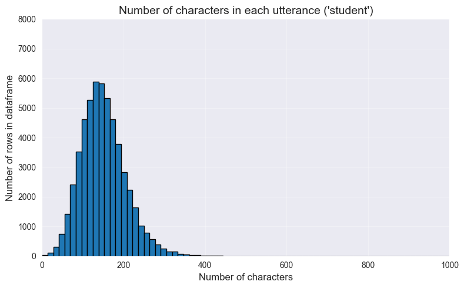
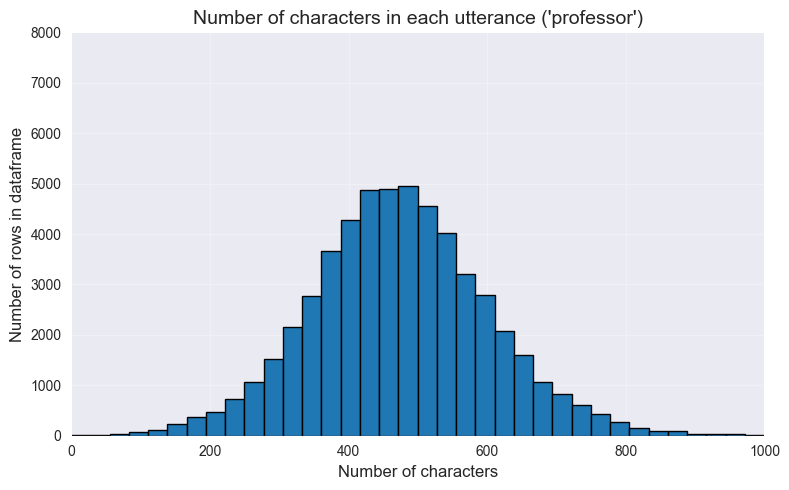
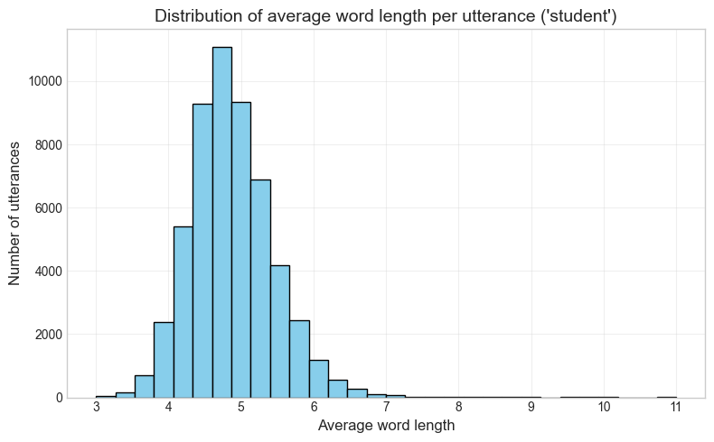
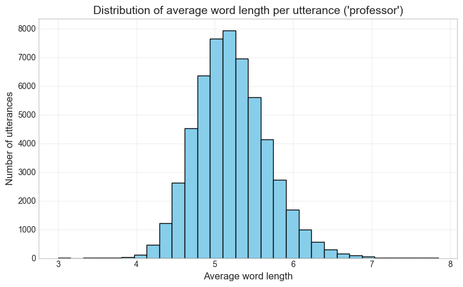
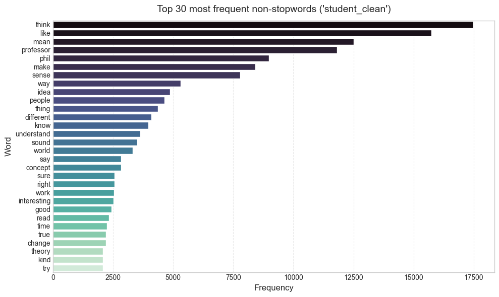
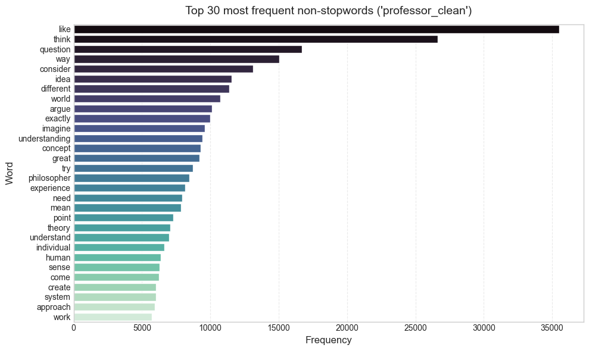
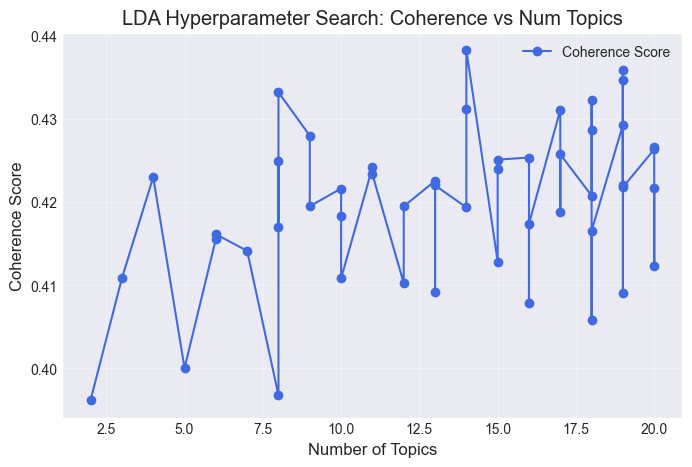

#### Zipf's law and entropy
The main goal of the project was providing the measures of Zipfian distribution over AI-generated text and examining the
entropy of this text.  Zipf's law can be understood as follows: _the Zipfian frequency of a word is inversely proportional to it's rank._
We implemented it by introducing the following equation: 

$$f_n = \frac{f_1}{n}$$ 

Where:
- $f_n$ is the Zipfian frequency of $n$ the word
- $f_1$ is the frequency of the most popular word
- $n$ is the index (sorted hierarchy of frequencies) of the $n$ word

In case of the entropy, we followed the implementation provided in this repository: [entropy](https://github.com/ambron60/shannon-entropy-calculator).
It's a classical, Shanonian implementation which can be described as:

$$H(X) = -\sum_{i=1}^{n} P(x_i) \log_2 P(x_i)$$

Where:
- $P(x_i)$ is the probability of specific character
- $\log_2$ is logarithm sith basis 2 (describes a unit in bits)

However, the novelty of this repository is the fact that it intoduces also the Metric Entropy, which takes the classical
formula and divides it by the length of the encoded string. 

$$H_{metric}(X) = \frac{-\sum_{i=1}^{n} P(x_i) \log_2 P(x_i)}{l}$$

Where:
- $P(x_i)$ is the probability of specific character
- $\log_2$ is logarithm sith basis 2 (describes a unit in bits)
- $l$ is the length of the encoded string

Essentially, Metric Entropy represent the minimal number of bits that has to be employed to encode the information
provided in a specific string. Therefore, it's an intuitive implementation of how redundant the content of the string is.
As a analytic philosopher might put it, Metric Entropy quantifies exactly how much of an utterance could have been
condensed into a single, short email.

#### Results/Conclusion
The dataset followed Zipf's law to a close approximation (in comparison to two human-generated texts: the Tempest, and Swan's Way, which also folowed a Zipfian distribution) such that it could be considered Zipf-like. Unlike the Zipf-Mandelbrot law, which incorporates some fitting parameters in the denominator, the simple n/rank method often diverges from a pure Zipfian distribution, which we believe does not nullify our conclusion. We concluded that Zipf's law lies at least in the syntactic structure of language, since both human and machine generated texts seem to follow this law to a similar approximation. There is also another possiblity which we explore in the discussion. 

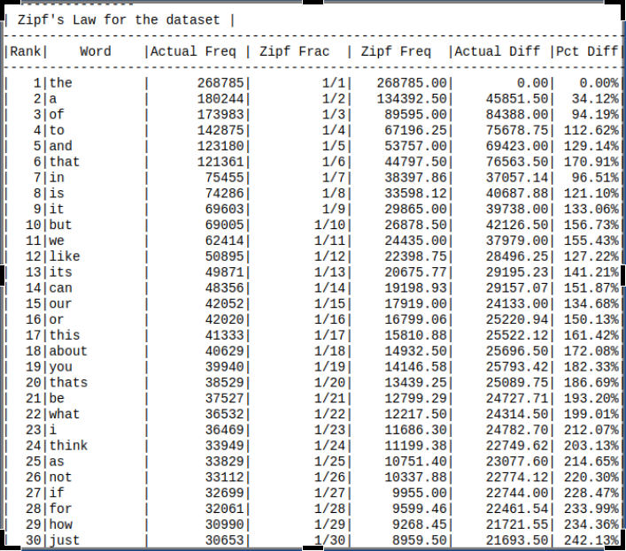
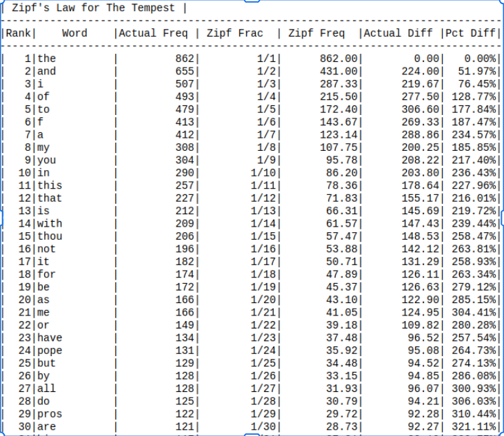
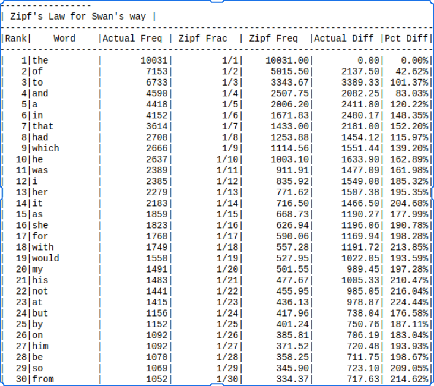

The entropy data reflected a recurrence pattern which became more pronounced from a character analysis to a lemma analysis, as is to be expected. Given that the entropy of the english language is very low at the character level, but there are many possible word choices to express an idea, it makes sense that the entropy increases in general from analysis on the level of character to word, and then from word to lemma. 

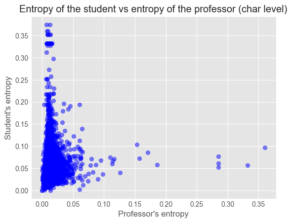
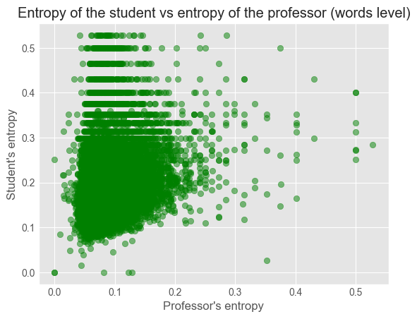
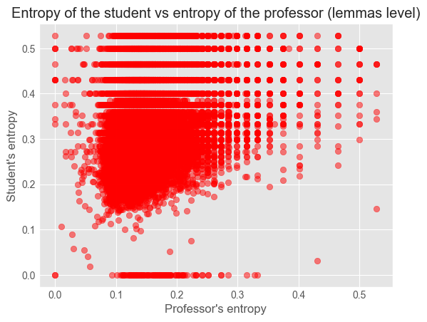

#### Discussion
Since LLMs exhibit Zipfian characteristics similar to those found in human generated texts, it seems that Zipfs law governs syntactic relations rather than semantic. We can say that either Zipf’s law is a description of the logical form of the language or it’s a general property of all ranked datasets. Although we did not include it in this analysis, there is evidence that other types of ranked data such as population or enconomics also follow a Zipf-like distribution, meaning that Zipf's law may not be a rule for syntax, as we propose, but rather a general property of all normally distributed and ranked data sets. 

The entropy results were quite interesting, as one moves up in scale of granularity from characterwise to lemmawise calculations, the chart begins to resemble a recurrence plot with consistent points of confluence. While we did not compare the entropy of the dataset to a control dataset such as a human conversation, it is probable that the entropy would not display such consistent behavior from entirely human generated text. at least, in general, the entropy of a response ought to be expected to be lower than that of teh question, in a dialogue, as the options for response are pre-limited by the question being posed. 

***
## Computer science

### Installation and requirements
To use spacy, you have to install the **spacy** package (via pip) 

`pip install spacy`

and download **en_core_web_sm** spacy model (tokenization)

`python -m spacy download en_core_web_sm`

Other dependencies can be downloaded with this command:

`pip install numpy pandas seaborn wordcloud matplotlib spacy gensim pyldavis optuna fastparquet pyarrow huggingface_hub`

### Sources of code
#### Online 
- https://www.geeksforgeeks.org/python/extract-dictionary-value-from-column-in-data-frame/
- https://www.geeksforgeeks.org/python/how-to-add-empty-column-to-dataframe-in-pandas/
- https://www.geeksforgeeks.org/nlp/zipfs-law/
- https://codedrome.substack.com/p/zipfs-law-in-python
- https://neptune.ai/blog/exploratory-data-analysis-natural-language-processing-tools
#### GitHub repositories
- https://github.com/CodeDrome/zipfs-law-python
- https://github.com/ambron60/shannon-entropy-calculator